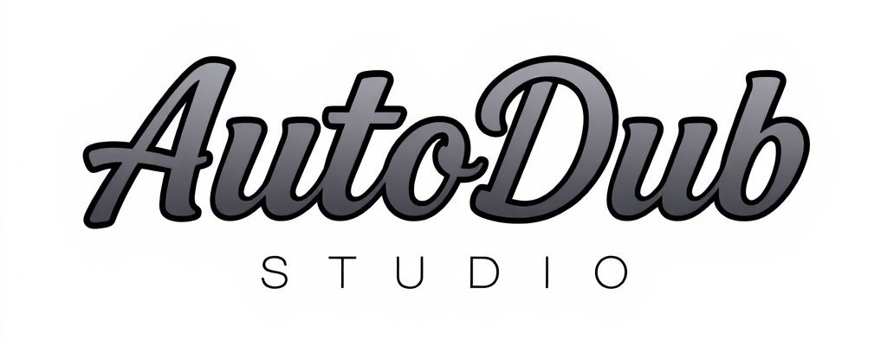
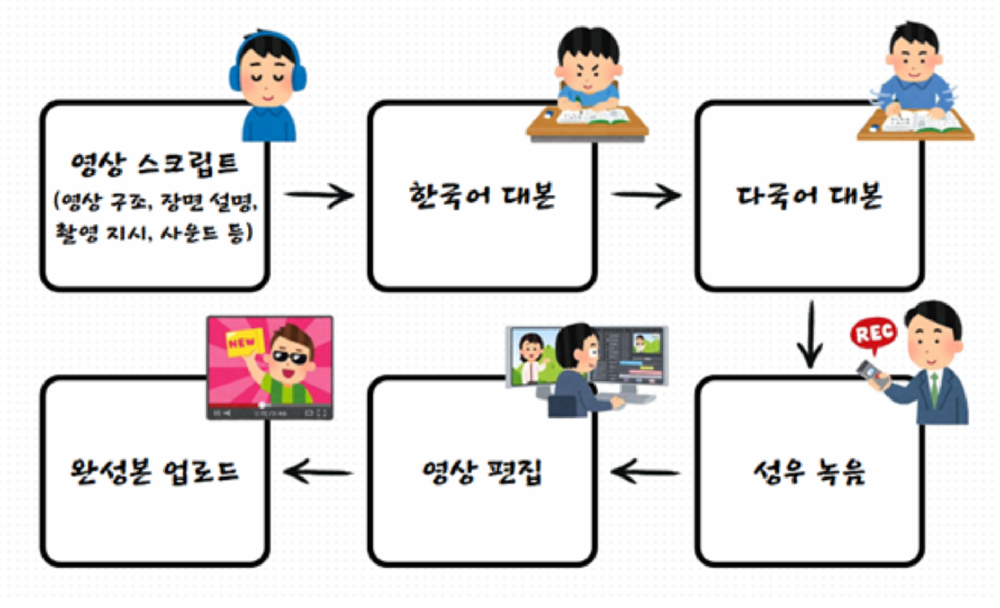
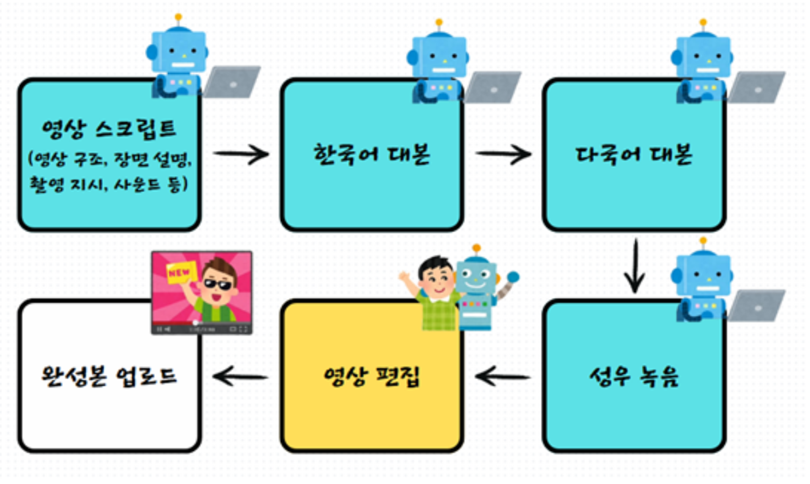
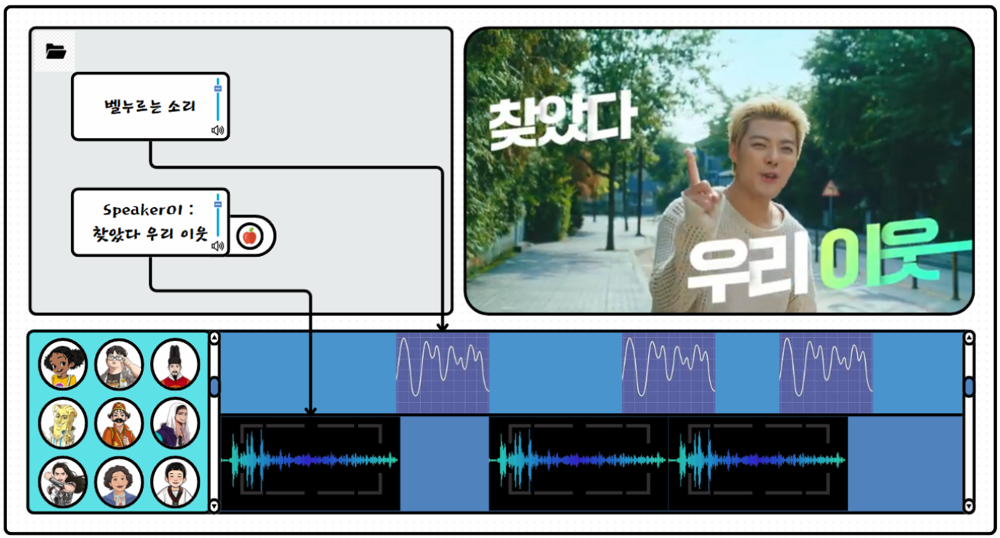
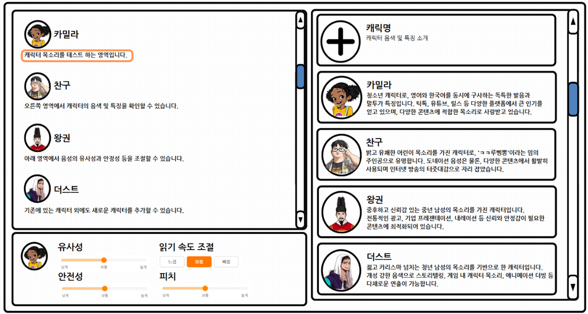

<!-- logo -->

### 🎬 맞춤형 음성 제작 및 영상 번역 더빙 플랫폼 🎙️

## 📝 소개

> "언어의 장벽을 허물고, 영상 콘텐츠를 더 많은 사람들에게!"

🎥 AutoDubSTUDIO는 기존의 영상 더빙 시스템에서 [ 영상 스크립트 → 번역 → 성우 녹음 ] 과정을  자동화하여 언어, 기술, 비용의 장벽 없이 누구나 더빙할 수 있도록 돕는 영상 더빙 프로젝트입니다.

### 개발 목표

|                 기존의 영상 더빙                  |                   AutoDubSTUDIO                   |
| :-----------------------------------------------: | :-----------------------------------------------: |
|  |  |
|                                                   |

## 🚀 주요 기능

📂 영상 업로드 & 자동 배치

1. **영상 업로드 및 저장**

   - 사용자가 업로드한 영상을 서버에 저장하고, 해당 영상의 길이와 경로 정보를 기록합니다.
   - 업로드 즉시 영상 파일에서 오디오를 추출하여 별도의 폴더에 저장합니다.

2. **오디오 분리 자동화**

   - 추출된 오디오를 Spleeter를 통해 자동으로 보컬(음성)과 반주(배경음악)로 분리합니다.
   - 분리된 보컬과 배경음악의 파일 경로를 받아 이후 처리 단계에 활용합니다.

3. **자동 STT 및 번역 처리**

   - 분리된 보컬 오디오를 Clova Speech Long Sentence API에 전달하여 음성 인식(STT)을 수행합니다.
   - 인식된 텍스트를 PostgreSQL DB에 저장하고, OpenAI GPT-4를 통해 영어 번역을 자동으로 진행합니다.

4. **TTS 생성 요청 및 최종 데이터 조합**
   - STT 및 번역 데이터 기반으로 ElevenLabs API를 호출해 TTS 오디오를 생성합니다.
   - 영상, 배경음악, TTS 트랙 등 모든 데이터를 통합해 편집용 정보 패키지를 자동으로 구성합니다.

 

🎛️ 직관적인 영상 편집 기능

1. **타임라인 기반 편집 인터페이스**

   - 영상 업로드 후 자동으로 추출된 음성, 번역, TTS 데이터가 타임라인에 배치되어 편집하기 쉽도록 제공됩니다.
   - 각 트랙(원본 대사, 번역 텍스트, TTS 오디오)의 시작 시간과 지속 시간이 명시되어 있어, 사용자가 직관적으로 편집할 수 있습니다.

2. **세부 편집 및 미리보기 기능**

   - 사용자 인터페이스에서는 영상 및 오디오의 개별 클립을 확인하고, 필요한 부분을 손쉽게 재배치하거나 수정할 수 있습니다.
   - 각 편집 트랙에 대한 소요 시간 및 처리 단계별 타이밍 정보를 함께 제공해, 작업의 효율성과 정확성을 높입니다.

3. **자동 배치 및 동기화**

   - 자동으로 추출된 STT, 번역, TTS 데이터가 영상과 동기화되어 배치되므로, 추가 편집 없이도 완성도 높은 결과물을 미리 확인할 수 있습니다.
   - 배경음악과 TTS 오디오의 볼륨 및 시작 시점을 조정할 수 있어, 사용자 맞춤형 편집이 가능합니다.

 

🎙️ 맞춤형 음성 모델 제작

1. **보이스 모델 생성 프로세스**

   - 사용자가 업로드한 음성 파일에서 Spleeter를 이용해 보컬만 분리하고, 불필요한 무음 구간을 제거하여 정제된 음성 데이터를 확보합니다.
   - 정제된 음성을 병합 및 분할하여 최대 25개의 샘플 파일로 가공, ElevenLabs API에 전달해 맞춤형 보이스 모델을 생성합니다.

2. **세밀한 전처리 및 샘플링**

   - 음성 파일의 무음 구간을 감지해 자연스러운 전환(fade-in, fade-out) 효과를 적용, 고품질 음성 샘플을 생성합니다.
   - 전체 음성이 너무 긴 경우, 최대 30초 단위로 분할하여 균일한 샘플 세트를 구성함으로써 모델 학습 효율성을 높입니다.

3. **DB 연동 및 결과 관리**

   - 생성된 보이스 모델의 ID, 이름, 설명 등의 정보를 PostgreSQL DB에 저장하여, 나중에 편리하게 호출 및 관리할 수 있도록 합니다.
   - 보이스 모델 제작 완료 후, 임시 파일 및 작업 관련 데이터를 정리해 시스템 리소스를 효율적으로 관리합니다.

## 🖥️ 화면 구성 (프로토타입)

 

## 🗂️ APIs

작성한 API는 아래에서 확인할 수 있습니다.

👉🏻 [API 바로보기]()

 

## 📚 기술 스택

🔹 Front-end

      

🔹 Back-end

    

🔹 Database

 

🔹 AI

    

🔹 Media Processing

    

🔹 Tool

   

## 🤔 기술적 이슈와 해결 과정

- 보이스 모델 품질을 어떻게 올릴수 있을까 ?
  - [보이스 모델 품질]()
- 화자분리, STT 작업 시간을 줄일 수 있는 방법은 ?
  - [화자분리&STT]()

 

## 💁‍♂️ 프로젝트 팀원

|                                             Backend                                              |                                            Frontend                                             |
| :----------------------------------------------------------------------------------------------: | :---------------------------------------------------------------------------------------------: |
|  |  |
|                              [이재현](https://github.com/leeway01)                               |                              [이주영](https://github.com/ele-003)                               |
